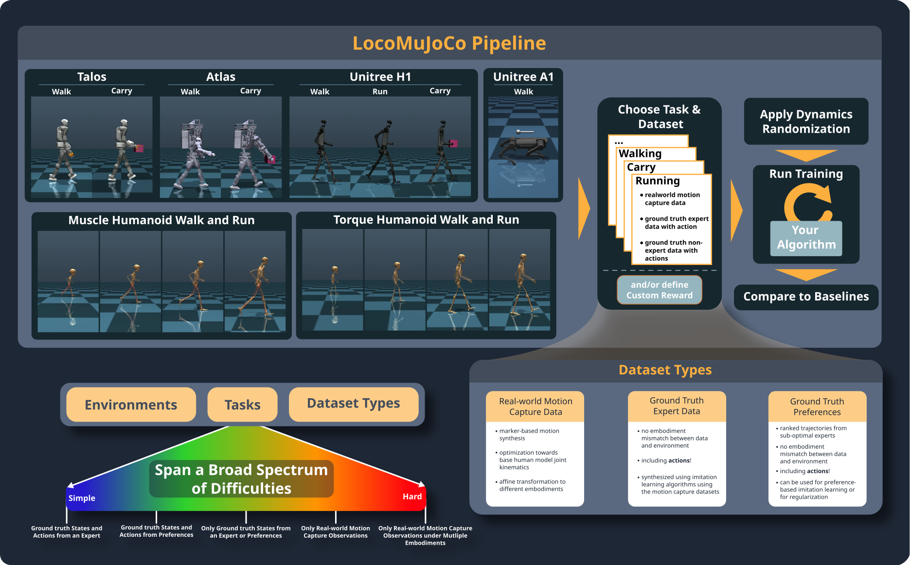

API Documentation
====================

Environments
-----------

.. image:: https://github.com/robfiras/loco-mujoco/assets/69359729/73ca0cdd-3958-4d59-a1f7-0eba00fe373a

LocoMuJoCo focuses on *Loco*motion environments. This includes humanoids and quadrupeds, with
a strong focus on the latter. The environment is built on top of MuJoCo. The aim of LocoMuJoCo is to be
a simple and easy-to-use environment for imitation learning and reinforcement learning while shifting the focus towards
realistic and complex tasks crucial for real-world robotics. LocoMuJoCo strives to be simple and user-friendly, offering
an environment tailored for both imitation and reinforcement learning. Its main objective is to shift the focus away from
simplistic locomotion tasks often used as benchmarks for imitation and reinforcement learning algorithms, and instead
prioritize realistic and intricate tasks vital for real-world robotics applications.

For imitation learning, it is crucial to have a good and diverse datasets. LocoMuJoCo makes it very simple to generate
diverse datasets of different difficulty levels in a single line of code. This allows the user to focus on the learning
algorithm and not worry about the environment. Here is a simple example of how to generate a the environment and the dataset
for the Unitree H1 robot:

.. literalinclude:: ../../examples/simple_gymnasium_env/example_unitree_h1.py
    :language: python

.. note:: As can be seen in the example above *Task-IDs* (e.g., "UnitreeH1.run.real") are used to choose what environment,
    task and dataset type to use. The general structure of a Task-Id is `<environment>.<task>.<dataset_type>`.
    For the Task-ID, you have to choose *at least* the environment name. Missing
    information will be filled with default settings, which are "walk" for the task and "real" for the dataset type for the
    Unitree H1 robot. A list of all available *Task-IDs* in LocoMuJoCo is given in the :doc:`./loco_mujoco.environments`.
    Alternatively, you can use the following code:

    .. code-block:: python

        from loco_mujoco import LocoEnv

        task_ids = LocoEnv.get_all_task_names()

.. toctree::
    :hidden:

    ./loco_mujoco.environments.rst
    ./loco_mujoco.environments.humanoids.rst
    ./loco_mujoco.environments.quadrupeds.rst
    ./loco_mujoco.environments.base.rst

Datasets
-----------
LocoMuJoCo comes with three different types of datasets: *real* , *perfect*, *preference*. The *real* dataset consists of
motion capture datasets for the humanoids environment and an MPC control for the Unitree A1 quadruped. These datasets
do not contain actions, and might suffer from mismatches (e.g., floating feet, inacturate foot forces etc.). The *perfect*
datasets are datasets generated from a policy trained with the best performing baseline algorithm. This dataset comes
with actions and is perfect in the sense that it is generated in the same environment, i.e., no mismatches. The *preference*
datasets are similar to the *perfect* datasets, but they are generated from a policy trained which are not the best performing.
This dataset contains multiple ranked sets of trajectories. While the real dataset is available on all environments, the
perfect and preference datasets are only available for some environments. A detailed overview is given at: :ref:`env-label`.
The main class that is handling datasets in LocoMuJoCo is the :doc:`Trajectory <./loco_mujoco.trajectory>` class.

.. toctree::
    :hidden:

    ./loco_mujoco.trajectory.rst

Below you can find the pipeline of LocoMuJoCo. First an environment is chosen. Then a task to be solved is chosen.
Afterwards, a dataset type is chosen. During training domain randomization can be applied. Finally, the trained model
can be compared to the baseline algorithms. The environment, task, and dataset type define the difficulty. Training
on real dataset is generally more challenging due to the lack of actions and mismatches.

Rewards
-----------
When doing imitation learning, rewards are only used for evaluation purposes. The rewards are not used during training.
Each environment comes with a default reward function. However, the user can easily change the reward function to another
one, or even provide a default reward function as shown in the :doc:`./tutorials/reinforcement_learning` tutorials.
:doc:`Here <./loco_mujoco.rewards>` you find all reward functions that are available in LocoMuJoCo.

.. toctree::
    :hidden:

    ./loco_mujoco.rewards.rst

Domain Randomization
--------------------

LocoMuJoCo comes with build-in domain randomization. In contrast to others, LocoMuJoCo randomizes parameters
in the XML and recompiles the complete model whenever needed. We do so to ensure that the randomization is consistent
across all parameters, as some parameters are calculated based on others *during compilation*. An example is the the
default inertia from geometries. The latter is calculated based on the shape and mass of the geometry. When just randomizing
the mass *of the model*, the inertia will remain unchanged resulting in inconsistent randomization. However, if the mass
is randomized *in the XML* and the model is recompiled, the inertia will be recalculated based on the new mass resulting
in consistent randomization. :doc:`Here <./loco_mujoco.domain_randomization>`, you find the API for domain randomization.
Also take a look at the :doc:`./tutorials/domain_randomization` tutorials to see how to use domain randomization in
LocoMuJoCo.

.. toctree::
    :hidden:

    ./loco_mujoco.domain_randomization.rst